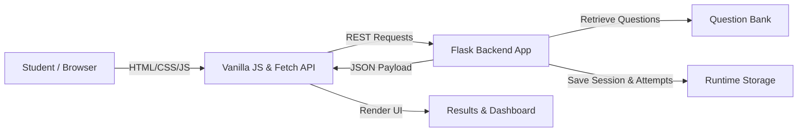

# 🚀 SkillForge

> **"Learn. Test. Improve."**

SkillForge is a lightweight full-stack Web Technology mini-project designed for skill-based educational assessment. Students can choose skills, attempt 10-question timed quizzes, view instant scores, and review detailed answer explanations to track their mastery over time.

---

## ⚡ Features

- **Skill Directory:** 8 domains (HTML & CSS, JavaScript, Python, SQL, Data Structures, Web Technology, Computer Networks, Cloud Fundamentals) with live search and category/difficulty filters.
- **Assessment Engine:** Dynamic question rendering, custom option selectors, question navigator, and 10-minute countdown timer.
- **Answer Shielding:** Server-side answer key validation (correct answers are never exposed to the client prior to submission).
- **Instant Result & Review:** Detailed score breakdown (Correct, Incorrect, Unanswered) with question-by-question explanations.
- **Learning Analytics:** Dynamic dashboard featuring overall average score, best score, questions answered, and per-skill progress indicators.
- **Attempt History:** Log of past attempts with instant review drawer access.

---

## 🛠️ Tech Stack

- **Frontend:** HTML5, CSS3 (Custom EdTech Visual Identity), Vanilla JavaScript (ES6+), Fetch API
- **Backend:** Python 3 (Flask)
- **Storage:** Runtime Python Memory (No Database)

---

## 🏗️ Architecture



---

## 📁 Project Structure

```
skillforge/
├── app.py              # Flask server & REST API routes
├── requirements.txt    # Minimal dependencies (Flask)
├── README.md           # Project documentation
├── .gitignore          # Git exclusion rules
├── templates/          # HTML Page Templates (index, skills, assessment, result, history)
└── static/             # Static Assets
    ├── css/style.css   # EdTech CSS Styling
    └── js/app.js       # Client Engine & Timer State
```

---

## 🚀 How to Run

1. **Install Dependencies:**
   ```bash
   python -m pip install -r requirements.txt
   ```

2. **Start Server:**
   ```bash
   python app.py
   ```

3. **Access App:** Open `http://127.0.0.1:5000` in your web browser.

---

## 🔌 API Endpoints Summary

- `GET /api/skills` — List all skills with attempt stats
- `POST /api/assessments/start` — Start an assessment session
- `POST /api/assessments/submit` — Submit answers & receive score
- `GET /api/attempts` — Get attempt history
- `GET /api/dashboard` — Get dashboard metrics

---

> ℹ️ **Note:** This is an educational mini-project demo. All assessment attempt data is stored in runtime Python memory and resets when the Flask server restarts.
